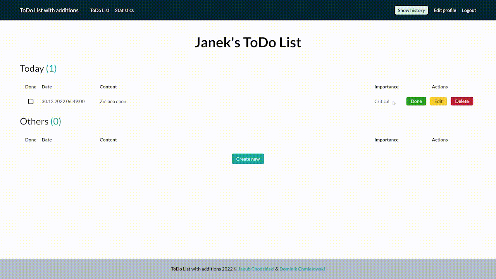
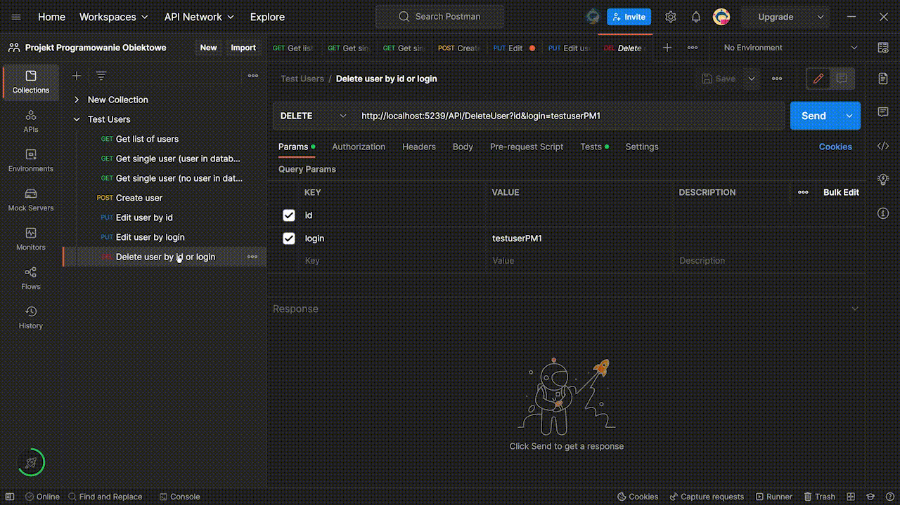

# Documentation

Animated GIFs which shows core functionality of the project and Postman tests.

## Landing page

## User - Register

## User - Edit profile

## User - Logout, login and delete profile

## ToDo - Create

## ToDo - Edit

## ToDo - Done and delete

## Statistics

## Admin - List users

## Admin - Create user

## Admin - Edit user

## Admin - User's todos

## Admin - Create user's todo

## Admin - Edit user's todo

## Admin - Done and delete user's todo

## Postman - Get list of users

## Postman - Get single user (user exists)

## Postman - Get single user (user doesn't exist)

## Postman - Create user

## Postman - Edit user by id

## Postman - Edit user by login

## Postman - Delete user

