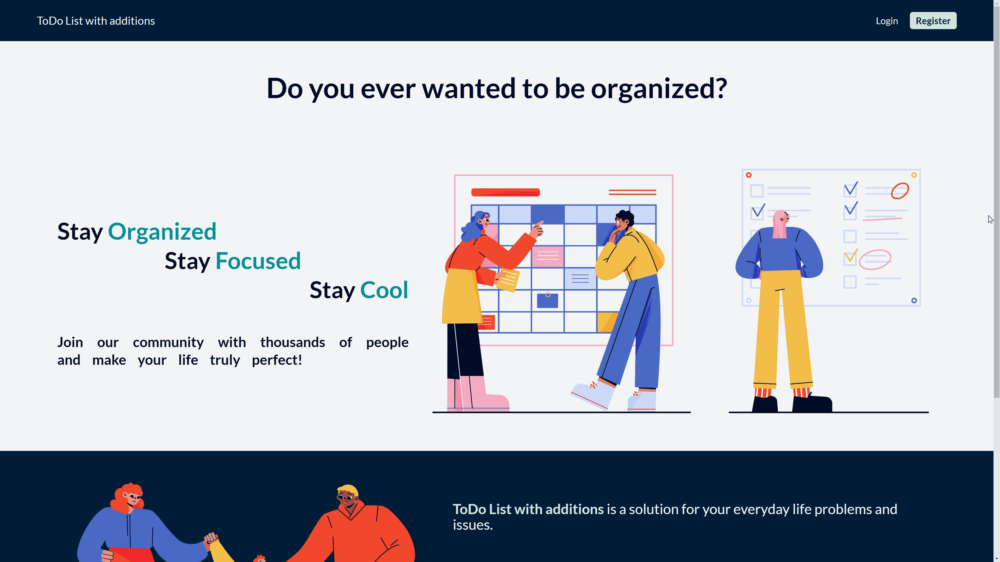

# ToDoList - CRUD Application

Simple fullstack application written in ASP.NET MVC pattern and created as a college project.

## Documentation

_Click on the photos to open corresponding page!_

**Animated GIFs:** 

**YouTube video:** 

## Main Functionality

<ul>
<li>User</li>
    <ul>
        <li>Register</li>
        <li>Login</li>
        <li>Logout</li>
        <li>Edit profile</li>
        <li>Delete profile</li>
    </ul>
<li>ToDo</li>
    <ul>
        <li>Create</li>
        <li>Edit</li>
        <li>Delete</li>
        <li>Done</li>
    </ul>
 <li>Statistics</li>
    <ul>
        <li>Graphs for every todo's importance with user's data</li>
        <ul>
            <li>Done</li>
            <li>Not done</li>
            <li>Postponed</li>
        </ul>
    </ul>
<li>Admin</li>
    <ul> 
        <li>List users</li>
        <li>Create user</li>
        <li>Edit user</li>
        <li>Show user todos</li>
        <li>Create user's todo</li>
        <li>Edit user's todo</li>
        <li>Delete user's todo</li>
        <li>Mark user's todo as done</li>
    </ul>
</ul>

## Technologies

Project is created with:           

-  .Net- Used to build backend structure of application
-  Chartjs - Used to create charts to display users todos data  
-  CSS - Used for styling views in application
-  MongoDB - Used for storing every data

## Tests

Tests are available in <a href="https://github.com/Xapixowy/ToDo-List-with-additions/blob/dev/Test%20Users.postman_collection.json">Postman</a>

## Authors

Dominik - https://github.com/Minio931   Jakub - https://github.com/Xapixowy
